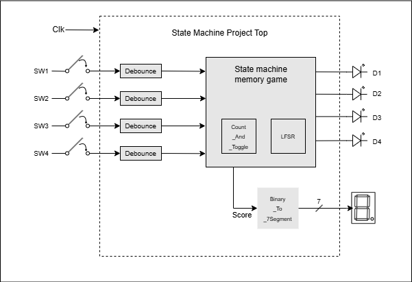

# FPGA Memory Game Project

## Project description
This project uses finite state machines and modular programming to create a memory game inside a Lattice ICE40 FPGA. Using four LEDs, the user will be shown a random pattern. These LEDs are also mapped to four switches inside the FPGA. If the user successfully recreates the pattern, they win the game. If not, they lose the game.

## Planning the state machine

  
In this state machine, the reset/initial condition will reset the state machine and jump into the START state regardless of which state was occupied previously. After the reset has been cleared, we transition into the PATTERN OFF state. We wait here with all four LEDs off for a set amount of time and then transition into the PATTERN SHOW state. In this state, a single LED will be illuminated for a set amount of time. If it is the last LED in the pattern, the state machine transitions into the WAIT PLAYER state to await the player's response. If the pattern is not done, the state machine goes back to PATTERN OFF. To avoid confusion to the user when the pattern is displayed, the state machine cycles back and forth between PATTERN OFF and PATTERN SHOW state to add a delay between each LED blink.
  
Once in the WAIT PLAYER state, the FPGA monitors the input from the user. If the player pushes an incorrect button in the sequence, we transition to the LOSER state and show an F on the seven segment display. If the player successfully recreates the entire pattern, then we transition to the INCR SCORE state.
Once at the INCR SCORE state, if the score is not at limit, we transition to the PATTERN OFF state and prepare to add and show another LED to the entire sequence. If however, the score is at the limit, the state machine transitions into the WINNER state and shows an A on the seven segment display.   

## Block Diagram of Project

 
